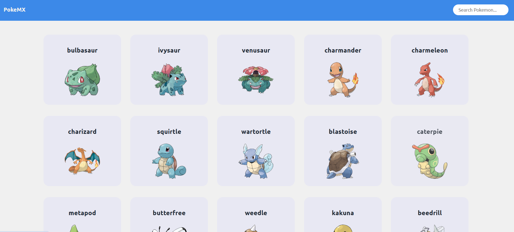

# HTMX Go Example

A Pokedex-inspired website created with Go and HTMX!



## Setup / Development

1\. [Install Go](https://go.dev/doc/install).

2\. Spin up the server:

```sh
go run .
```

---

Developed with 💚 [**@acmcsufoss**](https://github.com/acmcsufoss)
